# MXmap France - Hébergeurs de messagerie des communes françaises

Fork du projet [mxmap.ch](https://mxmap.ch) ([GitHub](https://github.com/davidhuser/mxmap)), adapté pour les communes françaises.

Une carte interactive montrant quel hébergeur gère la messagerie officielle de chaque commune française, à partir de l'analyse publique des enregistrements DNS (MX et SPF).

Code source de ce fork : [github.com/yohannes-git/mxmap-fr](https://github.com/yohannes-git/mxmap-fr)

## Comment ça marche

Le pipeline de données se déroule en trois étapes :

1. **Preprocess** - Télécharge l'archive DILA ([annuaire service-public.fr](https://lannuaire.service-public.gouv.fr/)) contenant les mairies françaises avec leur domaine et email de contact. Effectue les lookups MX et SPF sur chaque domaine, résout les inclusions SPF, suit les chaînes CNAME, détecte les gateways de filtrage, et classifie le provider email de chaque commune. Génère également les tuiles vectorielles des contours communaux (`communes.pmtiles`) depuis l'API IGN si absentes ou expirées.
2. **Postprocess** - Applique les overrides manuels pour les communes absentes de la DILA, relance les lookups DNS, vérifie les banners SMTP, tente une détection via autodiscover et SPF, scrape les sites web pour extraire des adresses email, et déduplique les mairies déléguées/associées déjà représentées par leur commune de rattachement (table COG INSEE).
3. **Validate** - Croise les enregistrements MX et SPF, attribue un score de confiance (0–100) à chaque entrée, et génère un rapport de validation.

```mermaid
flowchart TD
    trigger["Déclenchement"] --> dila

    subgraph pre ["1 · Preprocess"]
        dila[/"Archive DILA\nservice-public.fr"/] --> fetch["Chargement ~35 000 mairies"]
        ign[/"API IGN\ngeo.api.gouv.fr"/] --> topojson["Simplification + tuilage\ncommunes.pmtiles"]
        fetch --> domains["Extraction domaines +\nemail de contact"]
        domains --> dns["Lookups MX + SPF\n(3 résolveurs)"]
        dns --> spf_resolve["Résolution SPF includes\n& redirects"]
        spf_resolve --> cname["Suivi chaînes CNAME"]
        cname --> asn["Lookups ASN\n(Team Cymru)"]
        asn --> autodiscover["Autodiscover DNS\n(CNAME + SRV)"]
        autodiscover --> gateway["Détection gateways\n(Barracuda, Proofpoint,\nMimecast, VadeSecure, Cisco…)"]
        gateway --> classify["Classification providers\nMX → CNAME → SPF → Autodiscover → SMTP"]
    end

    classify --> overrides

    subgraph post ["2 · Postprocess"]
        overrides["Overrides manuels"] --> signals["Signaux autodiscover/SPF\npour communes sans MX"]
        signals --> retry["Retry DNS\n(+ domaine email contact)"]
        retry --> smtp["Vérification banner SMTP\n(EHLO port 25)"]
        smtp --> webmail["Détection webmail HTTP\n(/owa, /zimbra, /roundcube…)"]
        webmail --> scrape_urls["Scraping sites mairies"]
        scrape_urls --> extract["Extraction emails"]
        extract --> scrape_dns["Lookup DNS sur\ndomaines email extraits"]
        scrape_dns --> delegues["Dédup. mairies déléguées\n(table COG INSEE)"]
        delegues --> masquage["Masquage adresses email\n[omis]@domain.fr"]
        masquage --> reclassify["Reclassification finale"]
    end

    reclassify --> data[("data.json")]
    data --> score

    subgraph val ["3 · Validate"]
        score["Score de confiance · 0–100"] --> gwarn["Détection gateways\nnon référencés"]
        gwarn --> gate{"Quality gate\nmoy ≥ 55 · haute-conf ≥ 45%"}
    end

    gate -- "OK" --> deploy["Déploiement"]
    gate -- "Échec" --> issue["Rapport d'erreur"]

    style trigger fill:#e8f4fd,stroke:#4a90d9,color:#1a5276
    style dila fill:#e8f4fd,stroke:#4a90d9,color:#1a5276
    style ign fill:#e8f4fd,stroke:#4a90d9,color:#1a5276
    style data fill:#d5f5e3,stroke:#27ae60,color:#1e8449
    style deploy fill:#d5f5e3,stroke:#27ae60,color:#1e8449
    style issue fill:#fadbd8,stroke:#e74c3c,color:#922b21
    style gate fill:#fdebd0,stroke:#e67e22,color:#935116
```



## Providers détectés

| Catégorie | Providers |
|---|---|
| ☁️ Grandes plateformes | Microsoft 365, Exchange On-Prem, Google Workspace, Amazon AWS, Yahoo Mail |
| 🇫🇷 Hébergeurs FR / EU | OVHcloud, Gandi, IONOS (1&1), Infomaniak, BlueMind, Indépendant |
| 🏛️ Hébergement local | Domaine propre à la mairie (auto-hébergé) |
| 📡 FAI français | Orange / Wanadoo, Free / Alice / Tiscali, SFR / Neuf / Cegetel, Bouygues Telecom |

Les gateways de filtrage entrant (VadeSecure, Mimecast, Hornetsecurity, Barracuda, Proofpoint, Cisco…) sont détectés séparément et ne sont jamais retenus comme hébergeur final - le vrai hébergeur est retrouvé via le SPF derrière le gateway.

## Démarrage rapide

```bash
# Prérequis
npm install -g mapshaper      # simplification géométrie + dissolution départements
sudo apt install tippecanoe   # tuilage vectoriel (génère communes.pmtiles)

uv sync

# Pipeline complet
uv run preprocess   # génère communes.pmtiles si absent, puis scan DNS (~60–90 min)
uv run postprocess  # ~10–15 min
uv run validate     # ~1 min, doit afficher PASSED

# Serveur local - ⚠️ doit supporter les requêtes HTTP Range (byte serving) pour
# communes.pmtiles ; `python3 -m http.server` n'en est PAS capable (renvoie le
# fichier entier au lieu de 206 Partial Content, la carte reste vide)
npx serve
# → http://localhost:3000
```

Le premier `uv run preprocess` télécharge l'archive DILA (~350 Mo) et la met en cache localement pendant 23h (`.dila_cache.tar.bz2`). Les tuiles vectorielles des contours communaux (`communes.pmtiles`) et le GeoJSON des départements (`departements.geojson`) sont régénérés automatiquement si absents ou plus vieux que 30 jours.

## Développement

```bash
uv sync --group dev

# Tests avec couverture
uv run pytest --cov --cov-report=term-missing

# Lint
uv run ruff check src tests
uv run ruff format src tests
```

## Sources de données

- **Mairies et domaines** : [Annuaire service-public.fr](https://lannuaire.service-public.gouv.fr/) - DILA, licence ouverte v2.0
- **Contours communaux** : [API Géo](https://geo.api.gouv.fr/) - IGN / DINUM
- **Communes déléguées/associées** : [Code Officiel Géographique](https://www.insee.fr/fr/information/2560452) - INSEE, pour dédupliquer les anciennes mairies fusionnées dans une commune nouvelle
- **Classification** : analyse DNS publique des enregistrements MX et SPF

## Corrections manuelles

Pour signaler une mauvaise classification, les corrections peuvent être ajoutées au dict `MANUAL_OVERRIDES` dans `src/mail_sovereignty/postprocess.py` (clé = code INSEE, valeur = champs à écraser).

## Projet original

Ce projet est un fork de [mxmap.ch](https://mxmap.ch) de [David Huser](https://github.com/davidhuser/mxmap). L'architecture du pipeline, la logique de classification DNS et la structure du code sont issues du projet original, distribué sous licence MIT.
