# MXmap France — Hébergeurs de messagerie des communes françaises

Fork du projet [mxmap.ch](https://mxmap.ch) ([GitHub](https://github.com/davidhuser/mxmap)), adapté pour les ~35 000 communes françaises.

Une carte interactive montrant quel hébergeur gère la messagerie officielle de chaque commune française — cloud américain (CLOUD Act), hébergeurs français/européens, ou FAI grand public — à partir de l'analyse publique des enregistrements DNS.

## Comment ça marche

Le pipeline de données se déroule en trois étapes :

1. **Preprocess** — Télécharge l'archive DILA ([annuaire service-public.fr](https://lannuaire.service-public.gouv.fr/)) contenant toutes les mairies françaises avec leur domaine officiel. Effectue les lookups MX et SPF sur chaque domaine, résout les inclusions SPF, suit les chaînes CNAME, et classifie le provider email de chaque commune. Génère également le TopoJSON des contours communaux depuis l'API IGN si absent ou expiré.
2. **Postprocess** — Applique les overrides manuels, relance les lookups DNS pour les communes non résolues (en exploitant aussi l'email de contact DILA), vérifie les banners SMTP des MX indépendants, puis scrape les sites web des communes encore inconnues pour extraire des adresses email.
3. **Validate** — Croise les enregistrements MX et SPF, attribue un score de confiance (0–100) à chaque entrée, et génère un rapport de validation.

```mermaid
flowchart TD
    trigger["Déclenchement nightly"] --> dila

    subgraph pre ["1 · Preprocess"]
        dila[/"Archive DILA\nservice-public.fr"/] --> fetch["Chargement ~35 000 mairies"]
        ign[/"API IGN\ngeo.api.gouv.fr"/] --> topojson["Génération TopoJSON\ncontours communaux"]
        fetch --> domains["Extraction domaines +\nemail de contact DILA"]
        domains --> dns["Lookups MX + SPF\n(3 résolveurs)"]
        dns --> spf_resolve["Résolution SPF includes\n& redirects"]
        spf_resolve --> cname["Suivi chaînes CNAME"]
        cname --> asn["Lookups ASN\n(Team Cymru)"]
        asn --> autodiscover["Autodiscover DNS\n(CNAME + SRV)"]
        autodiscover --> gateway["Détection gateways\n(Barracuda, Proofpoint,\nMimecast, Vade Retro …)"]
        gateway --> classify["Classification providers\nMX → CNAME → SPF → Autodiscover → SMTP"]
    end

    classify --> overrides

    subgraph post ["2 · Postprocess"]
        overrides["Overrides manuels"] --> retry["Retry DNS\n(+ domaine email contact)"]
        retry --> smtp["Vérification banner SMTP\n(EHLO port 25)"]
        smtp --> scrape_urls["Scraping sites mairies\n(/contact, /mairie, /mentions-legales …)"]
        scrape_urls --> extract["Extraction emails\n+ déchiffrement TYPO3"]
        extract --> scrape_dns["Lookup DNS sur\ndomaines email extraits"]
        scrape_dns --> reclassify["Reclassification\nentrées résolues"]
    end

    reclassify --> data[("data.json")]
    data --> score

    subgraph val ["3 · Validate"]
        score["Score de confiance · 0–100"] --> gwarn["Détection gateways\nnon référencés"]
        gwarn --> gate{"Quality gate\nmoy ≥ 70 · haute-conf ≥ 80%"}
    end

    gate -- "OK" --> deploy["Commit & déploiement Pages"]
    gate -- "Échec" --> issue["Ouverture issue GitHub"]

    style trigger fill:#e8f4fd,stroke:#4a90d9,color:#1a5276
    style dila fill:#e8f4fd,stroke:#4a90d9,color:#1a5276
    style ign fill:#e8f4fd,stroke:#4a90d9,color:#1a5276
    style data fill:#d5f5e3,stroke:#27ae60,color:#1e8449
    style deploy fill:#d5f5e3,stroke:#27ae60,color:#1e8449
    style issue fill:#fadbd8,stroke:#e74c3c,color:#922b21
    style gate fill:#fdebd0,stroke:#e67e22,color:#935116
```



## Providers détectés

| Catégorie | Providers |
|---|---|
| ☁️ Cloud américain (CLOUD Act) | Microsoft 365, Google Workspace, Amazon AWS |
| 🇫🇷 Hébergeurs FR / EU | OVHcloud, Gandi, Indépendant |
| 📡 FAI français | Orange / Wanadoo, Free / Alice, SFR / Neuf, Bouygues Telecom, autres FAI |

## Démarrage rapide

```bash
# Prérequis
npm install -g mapshaper  # pour la génération du TopoJSON

uv sync

# Pipeline complet
uv run preprocess   # ~30-60 min (téléchargement DILA + scan DNS de 35 000 communes)
                    # génère aussi france-communes.json si absent
uv run postprocess  # ~20-30 min
uv run validate

# Serveur local
python3 -m http.server
# → http://localhost:8000
```

Le premier `uv run preprocess` télécharge l'archive DILA (~350 Mo) et la met en cache localement pendant 23h (`.dila_cache.tar.bz2`). Le TopoJSON des contours communaux (`france-communes.json`) est régénéré automatiquement si absent ou plus vieux que 30 jours.

## Développement

```bash
uv sync --group dev

# Tests avec couverture
uv run pytest --cov --cov-report=term-missing

# Lint
uv run ruff check src tests
uv run ruff format src tests
```

## Sources de données

- **Mairies et domaines** : [Annuaire service-public.fr](https://lannuaire.service-public.gouv.fr/) — DILA (Direction de l'information légale et administrative), licence ouverte v2.0
- **Contours communaux** : [API Géo](https://geo.api.gouv.fr/) — IGN / DINUM
- **Classification** : analyse DNS publique des enregistrements MX et SPF

## Corrections manuelles

Pour signaler une mauvaise classification, les corrections peuvent être ajoutées au dict `MANUAL_OVERRIDES` dans `src/mail_sovereignty/postprocess.py` (clé = code INSEE, valeur = champs à écraser).

## Projet original

Ce projet est un fork de [mxmap.ch](https://mxmap.ch) de [David Huser](https://github.com/davidhuser/mxmap), adapté pour la France. L'architecture du pipeline, la logique de classification DNS et la structure du code sont issues du projet original.

Le code source de ce fork est disponible sur [github.com/yohannes-git/mxmap-fr](https://github.com/yohannes-git/mxmap-fr).
